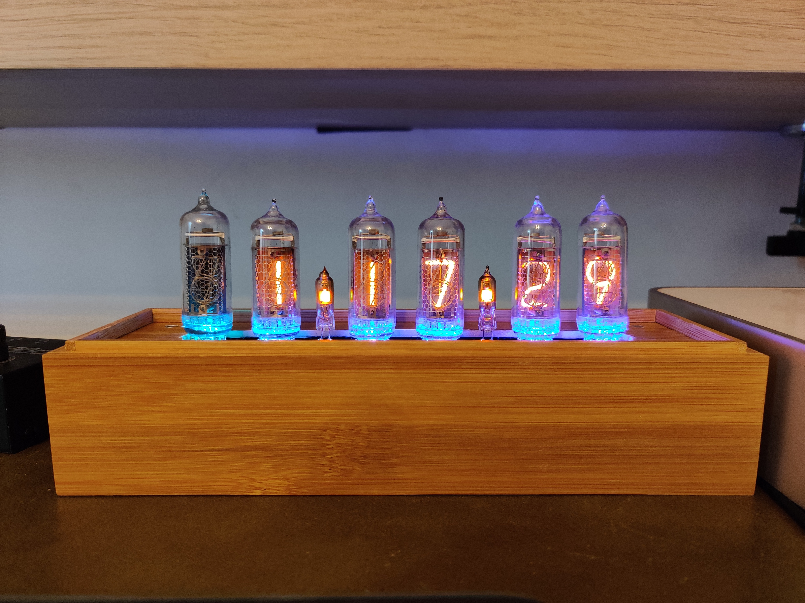
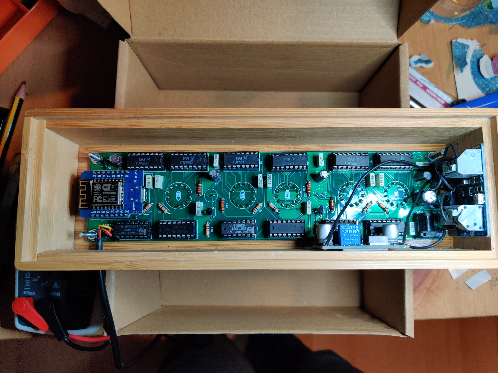
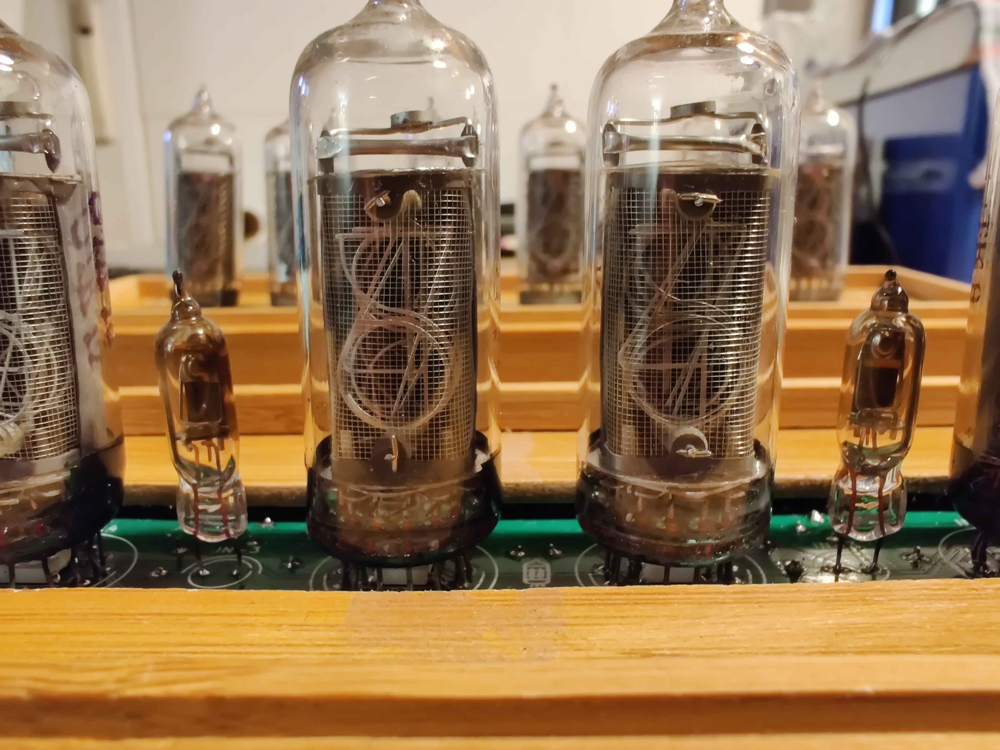

# Cloxie

Schematics and code for Cloxie: my Nixie Tube Clock.

The circuit and custom PCB are designed around the popular IN-14 Nixie tubes.

You can find the schematics here: https://github.com/vascofazza/cloxie_nixie_clock/blob/main/nixie_board/schematics.pdf

## Features

- NTP time sync over Wi-Fi
- The tubes are dimmable via PWM
- 6 RGB leds under the tubes with configurable patterns
- Automatic brightness control with a photoresistor
- Configurable via an onboard web server (reachable on the local network at: http://cloxie.local)
- Configurable via a dedicated Android App (available here: https://github.com/vascofazza/Cloxie-connect)
- Optional temperature sensor
- Alarm/Timer/StopWatch functionalities
- My girlfriend thinks it's cool

 

